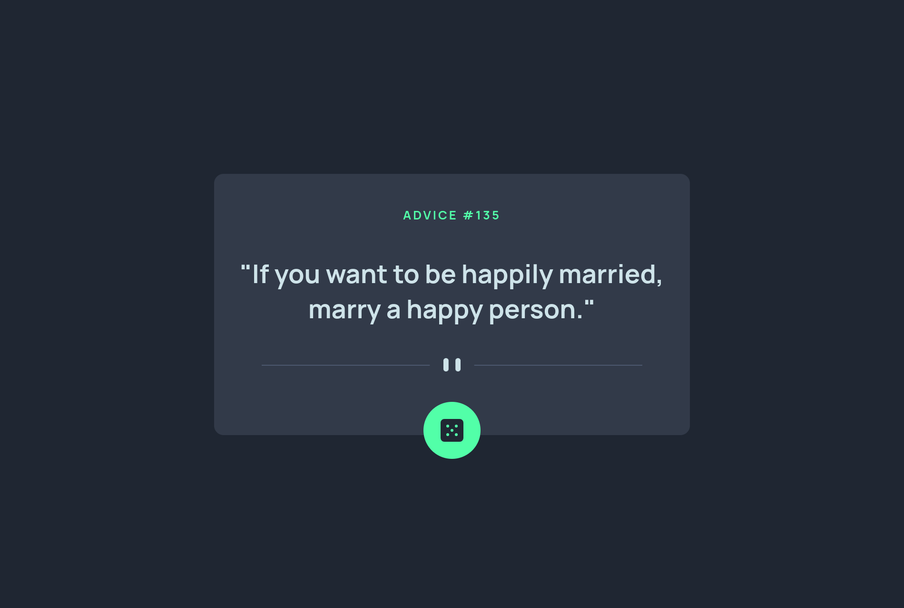

# Frontend Mentor - Advice Generator Challenge

This is a solution to the [Advice generator app challenge on Frontend Mentor](https://www.frontendmentor.io/challenges/advice-generator-app-QdUG-13db).This application generates random pieces of advice for users. It's built with a mobile-first approach and uses the Adviceslip API to fetch the advice.

## Overview

### The challenge

Users should be able to:

- View the optimal layout for the app depending on their device's screen size
- See hover states for all interactive elements on the page
- Generate a new piece of advice by clicking the dice icon

### Screenshot

## My process

### Built with

- Semantic HTML5 markup
- SCSS custom properties
- Flexbox
- Mobile-first workflow
- Vite Build Tool
- Adviceslip API

## Author

- Frontend Mentor - [dev-jlagunas](https://www.frontendmentor.io/profile/dev-jLagunas)

## Contact

For any questions or concerns, please contact Juan Lagunas at dev.jlagunas@gmail.com

## License

[MIT](https://choosealicense.com/licenses/mit/)
